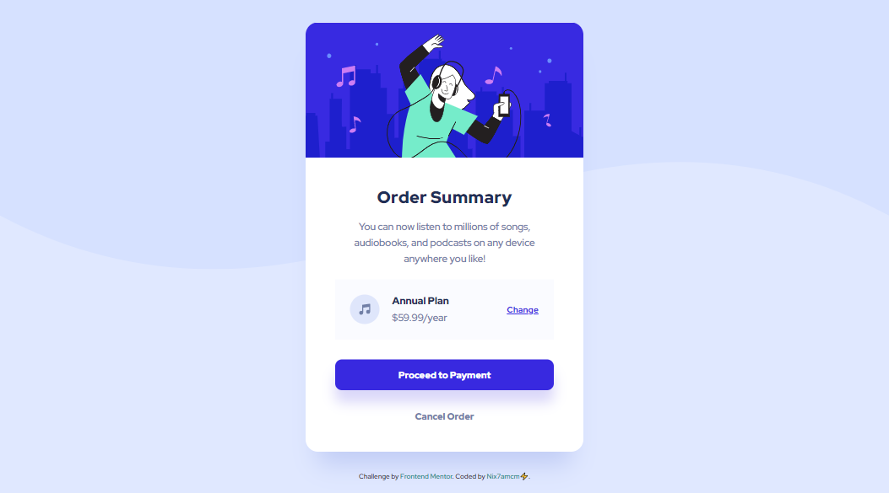
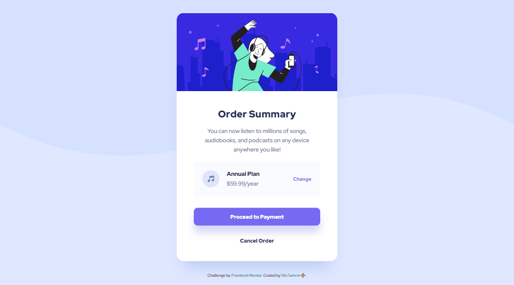

# Frontend Mentor - Order summary card solution

This is a solution to the [Order summary card challenge on Frontend Mentor](https://www.frontendmentor.io/challenges/order-summary-component-QlPmajDUj).

## Table of contents

- [Overview](#overview)
  - [Challenge Requirements](#challenge-requirements)
- [Screenshots](#screenshots)
- [Links](#links)
- [My process](#my-process)
  - [Built with](#built-with)
- [Author](#author)

---

## Overview

👩🏻‍💻 [Frontend Mentor](www.frontendmentor.io) challenges help you improve your coding skills by building realistic projects.

⚡ This challenge was to build a responsive order summmary card component.

🚀 I built this using HTML and CSS, with the help of [Figma](https://www.figma.com) for studying the design.

### Challenge Requirements

Users should be able to:

- See hover states for interactive elements

---

## Screenshots

---

## Links

- Solution URL: [frontendmentor.io/solutions/order-summary-card-component-5xGBUb22jP](https://www.frontendmentor.io/solutions/order-summary-card-component-5xGBUb22jP)
- Live Site URL: [nix7amcm.github.io/FEM-order-summary-component/](https://nix7amcm.github.io/FEM-order-summary-component/)

---

## My process

### Built with

- Semantic HTML5 markup
- CSS custom properties
- Flexbox
- CSS Grid
- Figma

---

## Author

- Website - [Nix7amcm](https://github.com/Nix7amcm)
- Frontend Mentor - [@Nix7amcm](https://www.frontendmentor.io/profile/Nix7amcm)
- LinkedIn - [amcm-8807](https://www.linkedin.com/in/amcm-8807/)

---
---
